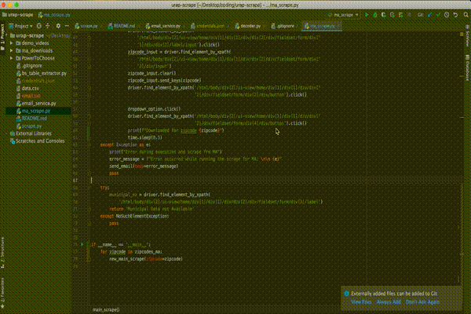

# Residential Electricity Price Scraping - UC Berkeley
A repository for web scraping for URAP research project - Investigationg residential electricity prices in the US

# How to Run 

Make sure you have Python 3 set up on your machine [Download Python](https://www.python.org/downloads/)

## Downloading the dependencies 

1. Download Chromedriver 76 or before (for Mac/Windows/Linux) [here](https://chromedriver.storage.googleapis.com/index.html?path=76.0.3809.126/)

    1. Unzip this, and make sure to add this to your project directory's root
    
2. Install all the project dependencies from `requirements.txt` using `pip install -r requirements.txt` (make sure when you run this command from your terminal, you are in your project directory)

    1. If your termninal does not recognize `pip`, try using `pip3` with the same command

### New York 

1. Download/Clone the repository to a local folder. Follow the steps here [Github Cloning Repository](https://help.github.com/en/github/creating-cloning-and-archiving-repositories/cloning-a-repository)

2. Enter the project folder in the terminal (make sure scrape.py is in your current directory)

3. Run `python3 scrape.py`

### Massachussets 

1. Go to the root directory and run the `ma_scrape.py`
2. To download the raw csv from the website, comment the `format_csv()` function in the main run in the file 
3. To just format the downloaded csvs, comment the `new_main_scrape()` function loop
4. To run everything in sync, run the `new_main_scrape()` loop and then the `format_csv()` function
5. To run for more than 50 zipcode change the following line in `ma_scrape.py` :
    1. `for zipcode in zipcodes_ma[:<number of zipcodes to run>]:`
    2. If you want to run for all the zipcodes (may take a long time), just change the line to `for zipcode in zipcodes_ma[:]:`

# Video Demos
### Video - Demo - New York


### Video - Demo - MA



## Power to Choose  

### Dependencies

| Name          | Installation Link                             | Purpose                                   |
| :---          |    :----:                                     |          ---:                             |
| Poppler       | https://poppler.freedesktop.org               | Used to perform OCR on PDfs               |
| wkhtmltopdf   | https://docs.bitnami.com/installer/apps/odoo/configuration/install-wkhtmltopdf/        | Used to convert HTML pages into PDFs      |

### Run

**NOTE: the scripts need to be executed from the PowerToChoose folder or else it will fail**

from the project folder, run:
```
cd PowerToChoose
python csv_generate.py <zip_code> <number_of_plans>
```

example:
`python csv_generate.py 75001 10`
